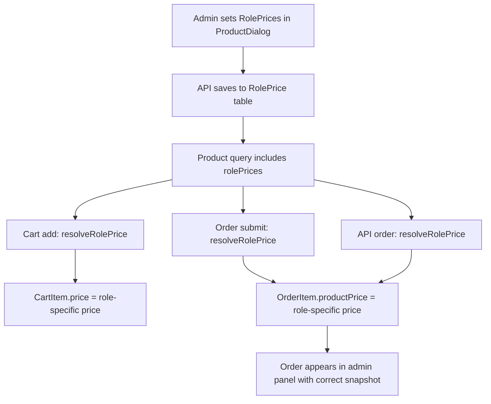

# Per-Account-Type Pricing Plan

## Overview
Replace the single global product price with role-specific pricing so each account type (USER, PREMIUM, NORMAL, SUPER, OTHER) can have its own price for the same product.

## Current Architecture
- [`Product`](tsk5_backend/prisma/schema.prisma:63) model has single `price` + optional `promoPrice`
- All dashboards resolve price via `(p.usePromoPrice && p.promoPrice != null) ? p.promoPrice : p.price`
- [`orderItem.productPrice`](tsk5_backend/prisma/schema.prisma:130) is a snapshot — already role-agnostic

## Proposed Changes

### 1. New Prisma Model: `RolePrice`

```prisma
model RolePrice {
  id        Int     @id @default(autoincrement())
  productId Int
  role      String  @db.VarChar(20)   // USER, PREMIUM, NORMAL, SUPER, OTHER
  price     Float

  product   Product @relation(fields: [productId], references: [id], onDelete: Cascade)

  @@unique([productId, role])
  @@index([productId])
  @@map("RolePrice")
}
```

**Migration**: Add the table. No data migration needed — existing products fall back to `Product.price`.

### 2. Backend Changes

#### a. Product API — Include role prices
- [`GET /products`](tsk5_backend/controllers/productController.js) — include `rolePrices` array in response
- [`POST /products`](tsk5_backend/controllers/productController.js) — accept optional `rolePrices` array
- [`PUT /products/:id`](tsk5_backend/controllers/productController.js) — accept optional `rolePrices` array (upsert)
- New endpoint: `PUT /products/:id/role-price` — upsert a single role price

#### b. Service layer
- [`productService.js`](tsk5_backend/services/productService.js) — add `upsertRolePrice(productId, role, price)` and `deleteRolePrice(productId, role)`
- When fetching products, always include `rolePrices: { select: { role, price } }`

#### c. Price resolution helper
Create `resolveRolePrice(product, userRole)`:
1. If product has `rolePrices` and one matches `userRole`, use that price
2. Else if `product.usePromoPrice && product.promoPrice != null`, use `promoPrice`
3. Else fall back to `product.price`

Used in:
- [`cartService.js`](tsk5_backend/services/cartService.js) — effective price when adding to cart
- [`orderService.js`](tsk5_backend/services/orderService.js) — effective price when submitting cart
- [`userApiService.js`](tsk5_backend/services/userApiService.js) — effective price for API orders
- [`externalApiService.js`](tsk5_backend/services/externalApiService.js) — external API (keep base price)
- [`shopController.js`](tsk5_backend/controllers/shopController.js) — shop orders (keep base price)

#### d. Cart flow update
When adding to cart (`POST /cart/add`):
- Resolve price using `resolveRolePrice(product, user.role)`
- Store that resolved price in `CartItem.price`

When submitting cart (`POST /order/submit`):
- [orderService.js](tsk5_backend/services/orderService.js):38 already resolves from cart items — no change needed since cart already has role-specific price

### 3. Frontend Changes

#### a. Admin ProductDialog.js
In the form section, add price input fields for each role:
```
[Base Price] [Promo Price]
--- Role Prices ---
[USER: ____] [PREMIUM: ____] [NORMAL: ____] [SUPER: ____] [OTHER: ____]
```
- Each field prefilled from `product.rolePrices` array
- On save, upsert role prices via the API
- Roles with empty/blank price = use base price (no override)

#### b. Dashboard price display
In each dashboard (`UserDashboard.js`, `Premium.js`, etc.):
- Update `getEffectivePrice` to accept `role` parameter
- Use `rolePrices` from the product object to find the matching role price
- Fall back to `promoPrice` / `price` if no role override

#### c. Cart total display
Same `getEffectivePrice` logic applies to cart calculation in each dashboard.

### 4. No-Change Zones
- **OrderItem** snapshot already stores `productPrice` at time of order — history is preserved
- **External API** pricing stays on base price (partners get same price)
- **Shop** (public storefront) stays on base price
- **StorefrontProduct** (agent-to-customer) has its own `customPrice` — no change needed
- **Admin dashboard** order views just read snapshots — no change needed

## Implementation Order
1. Prisma schema + migration
2. Backend: productService helpers + rolePrice routes
3. Backend: price resolution in cart/order/userApi flows
4. Frontend: Admin ProductDialog role-price UI
5. Frontend: Dashboard price display using role prices

## Mermaid Flow

