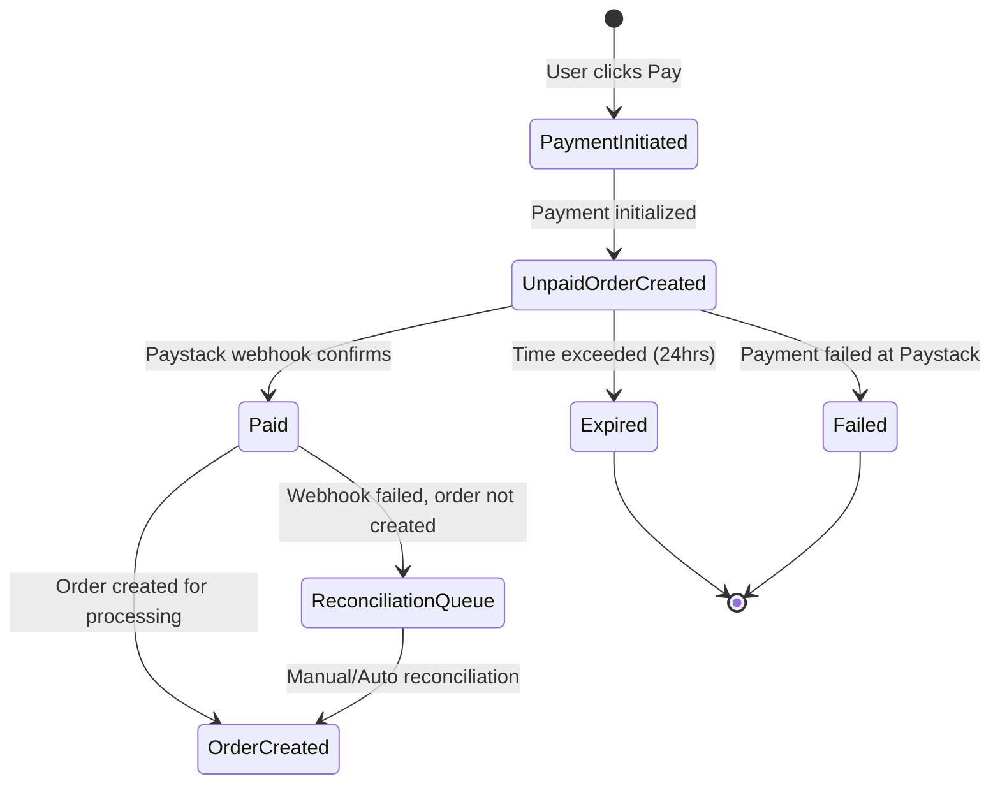

# Unpaid Orders Redesign - Architecture Plan

## Problem Analysis

### Current Issue
The reconciliation button reports "No missing orders found" even when there are failed payments on Paystack. This happens because:

1. **No persistent queue exists** for payments that are initiated but not yet confirmed
2. The current [`PaymentTransaction`](tsk5_backend/prisma/schema.prisma:271) table tracks payments but doesn't represent them as "pending orders" visible to admins
3. Reconciliation only checks for:
   - SUCCESS payments without orders (orphaned)
   - PENDING/INITIALIZED payments older than 3 minutes (stuck)
4. There's no admin-visible "unpaid orders" section to track these payment attempts

### Current Flow (Broken)
```
User selects product → Enters phone → Clicks Pay → Paystack redirect
                                                    ↓
                    (Webhook fails / Network issue / User closes browser)
                                                    ↓
                    PaymentTransaction exists in DB as PENDING/INITIALIZED
                                                    ↓
                    No order created, no admin visibility
                    Reconciliation may not catch it (time window issues)
```

## Proposed Solution

### Core Concept
Introduce a dedicated **UnpaidOrder** table that represents orders awaiting payment confirmation. This creates a clear "unpaid → paid → processing" pipeline that admins can monitor.

### Key Principles
1. **No unpaid orders sent for processing** - Only verified paid orders enter the Orders table
2. **Admin visibility** - Unpaid orders are trackable in a dedicated admin section
3. **Reconciliation source** - The UnpaidOrder table becomes the source of truth for reconciliation
4. **Automatic cleanup** - Paid unpaid-orders migrate to Orders; stale ones auto-expire

---

## Database Schema Changes

### New Table: UnpaidOrder

```prisma
model UnpaidOrder {
  id              Int      @id @default(autoincrement())
  externalRef     String   @unique @db.VarChar(255)  // Paystack reference
  productId       Int
  productName     String   @db.VarChar(255)
  mobileNumber    String   @db.VarChar(20)
  customerEmail   String?  @db.VarChar(255)
  amount          Float
  currency        String   @default("GHS") @db.VarChar(10)
  paymentUrl      String?  @db.VarChar(512)  // Paystack authorization URL
  paystackRef     String?  @db.VarChar(255)  // Paystack's internal reference
  
  // Status tracking
  status          String   @default("PENDING") @db.VarChar(50)  // PENDING, PAID, EXPIRED, FAILED
  paymentStatus   String   @default("UNPAID") @db.VarChar(50)   // UNPAID, PAID, FAILED
  
  // Payment attempt tracking
  paymentAttempts Int      @default(0)
  lastAttemptAt   DateTime?
  
  // Links
  paymentTransactionId Int?  @unique  // Link to PaymentTransaction
  paymentTransaction   PaymentTransaction? @relation(fields: [paymentTransactionId], references: [id], onDelete: SetNull)
  
  // Timestamps
  expiresAt       DateTime  // Order expires if not paid
  createdAt       DateTime  @default(now())
  updatedAt       DateTime  @default(now()) @updatedAt
  paidAt          DateTime?
  
  // Indexes for efficient queries
  @@index([status])
  @@index([paymentStatus])
  @@index([externalRef])
  @@index([mobileNumber])
  @@index([expiresAt])
  @@index([createdAt])
  @@map("UnpaidOrder")
}
```

### Modified Table: PaymentTransaction

Add a link back to UnpaidOrder:

```prisma
model PaymentTransaction {
  // ... existing fields ...
  unpaidOrderId   Int?     @unique  // Link to UnpaidOrder (1:1 relationship)
  unpaidOrder     UnpaidOrder? @relation(fields: [unpaidOrderId], references: [id], onDelete: SetNull)
  
  // Add index for reconciliation queries
  @@index([unpaidOrderId])
}
```

---

## API Endpoints

### Backend Routes (New/Modified)

| Method | Endpoint | Auth | Purpose |
|--------|----------|------|---------|
| GET | `/api/admin/unpaid-orders` | Admin | List all unpaid/pending orders |
| GET | `/api/admin/unpaid-orders/:id` | Admin | Get specific unpaid order details |
| POST | `/api/admin/unpaid-orders/:id/reconcile` | Admin | Manually reconcile a specific unpaid order |
| DELETE | `/api/admin/unpaid-orders/:id` | Admin | Expire/cancel an unpaid order |
| GET | `/api/payment/unpaid/count` | Admin | Get count of unpaid orders (for notification badge) |

### Modified Endpoints

| Method | Endpoint | Change |
|--------|----------|--------|
| POST | `/api/payment/initialize` | Create UnpaidOrder + PaymentTransaction atomically |
| POST | `/api/payment/webhook` | On success: migrate UnpaidOrder → Order |
| POST | `/api/payment/verify` | On success: migrate UnpaidOrder → Order |
| POST | `/api/payment/reconcile` | Reconcile from UnpaidOrder table instead of PaymentTransaction |

---

## Frontend Components

### New Components

1. **UnpaidOrdersTable** (`tsk5_frontend/src/components/UnpaidOrdersTable.js`)
   - Displays unpaid orders with columns: Reference, Product, Mobile, Amount, Status, Age, Actions
   - Actions: "Reconcile Now", "Expire", "View Details"
   - Filter by: Status (PENDING/PAID/FAILED/EXPIRED), Date range, Mobile number

2. **UnpaidOrderDetailsModal** (`tsk5_frontend/src/components/UnpaidOrderDetailsModal.js`)
   - Shows full order details, payment attempt history, Paystack verification status

### Modified Components

1. **AdminDashboard** (`tsk5_frontend/src/pages/AdminDashboard.js`)
   - Add "Unpaid Orders" tab in sidebar
   - Add notification badge count for pending unpaid orders
   - Add "Unpaid Orders" modal/section

2. **PaymentMessagesModal** (`tsk5_frontend/src/components/PaymentMessagesModal.js`)
   - Add option to view related unpaid order

---

## Order Flow State Machine



### State Definitions

| State | Description | Admin Action |
|-------|-------------|--------------|
| PENDING/UNPAID | Payment initialized, awaiting user payment | Wait or reconcile |
| PAID | Paystack confirms payment, order not yet created | Auto-migrate or manual reconcile |
| EXPIRED | Payment window exceeded (24hrs) | Auto-cleanup |
| FAILED | Paystack confirms payment failed | Auto-cleanup |

---

## Migration Strategy

### Phase 1: Database Migration
1. Create migration file for UnpaidOrder table
2. Add `unpaidOrderId` to PaymentTransaction
3. Run migration: `npx prisma migrate dev --name add_unpaid_order`

### Phase 2: Backfill Existing Data
For existing PaymentTransaction records without orders:
```javascript
// Migration script to backfill UnpaidOrder from PaymentTransaction
const transactions = await prisma.paymentTransaction.findMany({
  where: {
    orderId: null,
    status: { in: ['PENDING', 'INITIALIZED', 'SUCCESS'] }
  }
});

for (const tx of transactions) {
  await prisma.unpaidOrder.create({
    data: {
      externalRef: tx.externalRef,
      productId: tx.productId,
      productName: tx.productName,
      mobileNumber: tx.mobileNumber,
      amount: tx.amount,
      status: tx.status === 'SUCCESS' ? 'PAID' : 'PENDING',
      paymentStatus: tx.status === 'SUCCESS' ? 'PAID' : 'UNPAID',
      expiresAt: new Date(Date.now() + 24 * 60 * 60 * 1000),
      paymentTransactionId: tx.id
    }
  });
}
```

### Phase 3: Code Updates
1. Update `paymentService.initializePayment()` to create UnpaidOrder
2. Update `paymentService.handleWebhook()` to migrate UnpaidOrder → Order
3. Update `paymentService.verifyAndCreateOrder()` to check UnpaidOrder first
4. Update `paymentController.reconcilePayments()` to reconcile from UnpaidOrder
5. Add new admin endpoints for unpaid orders

### Phase 4: Frontend Updates
1. Add UnpaidOrdersTable component
2. Add sidebar navigation for "Unpaid Orders"
3. Update reconciliation button to show unpaid order count
4. Add notification badge for pending unpaid orders

---

## Security Considerations

1. **Webhook Signature Verification** - Keep existing Paystack signature verification
2. **Admin-Only Access** - All unpaid order endpoints require admin authentication
3. **Idempotency** - Reconciliation must be idempotent (prevent duplicate orders)
4. **Rate Limiting** - Apply rate limits to reconciliation endpoints

---

## Testing Checklist

- [ ] Payment initialization creates UnpaidOrder
- [ ] Webhook successfully migrates UnpaidOrder → Order
- [ ] Verify endpoint migrates UnpaidOrder → Order
- [ ] Reconciliation processes unpaid orders correctly
- [ ] Expired unpaid orders are cleaned up
- [ ] Admin can view unpaid orders list
- [ ] Admin can manually reconcile specific unpaid order
- [ ] No duplicate orders created from webhook + verify race condition
- [ ] Notification badge shows correct count

---

## Rollback Plan

If issues arise:
1. Keep existing PaymentTransaction-based reconciliation as fallback
2. Add feature flag to toggle between old/new reconciliation logic
3. Migration is additive (no data loss on rollback)

---

## Files to Modify

### Backend
| File | Changes |
|------|---------|
| `tsk5_backend/prisma/schema.prisma` | Add UnpaidOrder model, modify PaymentTransaction |
| `tsk5_backend/services/paymentService.js` | Add UnpaidOrder creation, migration logic |
| `tsk5_backend/controllers/paymentController.js` | Add unpaid order endpoints, update reconciliation |
| `tsk5_backend/routes/paymentRoutes.js` | Add new routes for unpaid orders |
| `tsk5_backend/controllers/adminController.js` | Add admin unpaid orders controller |
| `tsk5_backend/routes/adminRoutes.js` | Add admin unpaid orders routes |

### Frontend
| File | Changes |
|------|---------|
| `tsk5_frontend/src/pages/AdminDashboard.js` | Add unpaid orders tab, notification count |
| `tsk5_frontend/src/components/UnpaidOrdersTable.js` | New component |
| `tsk5_frontend/src/components/UnpaidOrderDetailsModal.js` | New component |
| `tsk5_frontend/src/endpoints/endpoints.js` | No changes needed (uses BASE_URL) |

---

## Timeline Estimate

| Phase | Tasks | Complexity |
|-------|-------|------------|
| Database Schema | Migration file, backfill script | Low |
| Backend Services | paymentService updates | Medium |
| Backend Controllers | New endpoints, reconciliation update | Medium |
| Frontend Components | New components, dashboard updates | Medium |
| Testing | End-to-end testing | Medium |
| Deployment | Migration, monitoring | Low |
